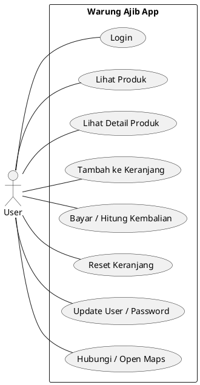
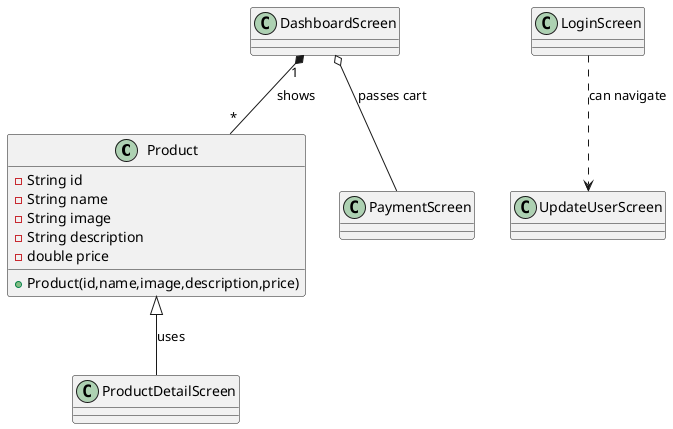
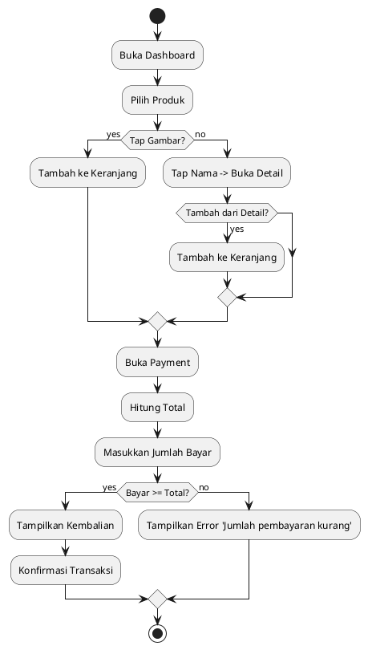

# Laporan UTS — Aplikasi Warung Ajib

## Daftar Isi
- Daftar Isi
- Latar Belakang
- Analisa dan Desain Aplikasi (OOP), Pemodelan UML
- Analisa Kebutuhan User
- Analisa Kebutuhan Hardware dan Software
- Diagram Use Case
- Diagram Class
- Diagram Aktivitas
- Desain Input dan Output
- Implementasi Sistem
- Penutup
- Lampiran Code Program

---

## Latar Belakang

Aplikasi ini dibuat untuk memenuhi kebutuhan UMKM "Warung Ajib" sebagai aplikasi kasir sederhana: menampilkan produk, menambah ke keranjang, menghitung total dan kembalian, serta fitur kontak (telepon / WhatsApp) dan manajemen user sederhana.

Tujuan pembuatan:
- Mempercepat pencatatan transaksi penjualan.
- Meminimalkan kesalahan hitung manual.
- Menyediakan cara cepat menghubungi penjual (WhatsApp/Call) dan menampilkan lokasi pada Maps.

---

## Analisa dan Desain Aplikasi (OOP)

Pendekatan: aplikasi dibangun dengan paradigma OOP menggunakan Flutter (Dart). Komponen utama dipecah menjadi model data, dan beberapa screen (kelas widget) untuk UI dan logika.

Kelas utama & tanggung jawab singkat:
- `Product` (model): menyimpan `id`, `name`, `image`, `description`, `price`.
- `LoginScreen`: autentikasi sederhana, menyimpan akun di `SharedPreferences`.
- `DashboardScreen`: menampilkan daftar produk, menangani keranjang (`Map<String,int>` untuk `productId -> qty`), dan navigasi ke pembayaran/detail.
- `ProductDetailScreen`: menampilkan detail produk, menyediakan aksi "Add to Cart" yang mengembalikan produk ke layar pemanggil.
- `PaymentScreen`: menerima `cart` map, menghitung total, menerima input pembayaran, menghitung kembalian, dan menyediakan reset keranjang.
- `UpdateUserScreen`: mengubah nama user/password oraz logout.

Prinsip desain yang dipakai:
- Single Responsibility: setiap screen bertanggung jawab untuk satu fitur UI/flow.
- Separation of Concerns: penyimpanan persisten (SharedPreferences) hanya dipakai pada layar login/update user.
- Defensive programming: pemeriksaan `mounted` dan penangkapan navigator/messenger sebelum operasi async untuk menghindari masalah context-after-async.

---

## Analisa Kebutuhan User

- Pengguna: pemilik warung / kasir.
- Fungsional:
  - Login / logout (persisten sederhana).
  - Tampilkan produk (grid), tambah ke keranjang (tap gambar), lihat detail (tap nama).
  - Checkout: list item, input jumlah bayar, hitung kembali, konfirmasi, reset.
  - Update user/password.
  - Hubungi via telepon / WhatsApp; buka lokasi (Maps).
- Non-fungsional:
  - Lokal, ringan, mudah dioperasikan.

---

## Analisa Kebutuhan Hardware dan Software

- Hardware: Smartphone Android (untuk jalankan aplikasi), komputer pengembang (macOS). Minimal Android 7+ (disesuaikan Flutter runtime).
- Software: Flutter SDK (tested dengan Flutter 3.x), Dart >=3.x, Android SDK + platform-tools (adb), VS Code/Android Studio.
- Dependensi utama:
  - `shared_preferences` — persistensi akun & sesi.
  - `url_launcher` — membuka whatsapp://, tel:, dan url maps.
  - `flutter_lints` (dev) — membantu perbaikan static analysis.

---

## Diagram Use Case

File PlantUML: [`docs/use_case_diagram.puml`](docs/use_case_diagram.puml)



Catatan: untuk merender PlantUML Anda dapat menggunakan VS Code PlantUML extension atau PlantUML server/CLI.

---

## Diagram Class (PlantUML)

File PlantUML: [`docs/class_diagram.puml`](docs/class_diagram.puml)



---

## Diagram Aktivitas (Activity Diagram)

File PlantUML: [`docs/activity_diagram.puml`](docs/activity_diagram.puml)

Flow Pembelian (Use case: Bayar)



---

## Desain Input dan Output

- Input:
  - `username`, `password` (Login)
  - `Jumlah Pembayaran` (numeric) di `PaymentScreen`
  - Update `nama pengguna` dan `password` di `UpdateUserScreen`
- Output/UI:
  - Grid produk (image, name, price)
  - Detail produk (name, price, description, image)
  - Keranjang: list item (name, qty, price, subtotal)
  - Dialog konfirmasi pembayaran (Total/Dibayar/Kembali)
  - SnackBar untuk notifikasi (produk ditambahkan, reset, error)

---

## Implementasi Sistem

Struktur file utama (repo):

```
pubspec.yaml
lib/
  main.dart
  models/product.dart
  screens/
    splash_screen.dart
    login_screen.dart
    dashboard_screen.dart
    product_detail_screen.dart
    payment_screen.dart
    update_user_screen.dart
android/
  app/src/main/AndroidManifest.xml (ditambah <queries> untuk whatsapp/tel)
```

Alur penting:
- Login: `SharedPreferences` menyimpan map `accounts` dan key `currentUser`/`isLoggedIn`.
- Keranjang: `DashboardScreen` menyimpan `Map<String,int>` untuk `productId -> qty`, diteruskan ke `PaymentScreen` via konstruktor.
- WhatsApp/Call: `url_launcher` digunakan; coba `whatsapp://send?phone=` dulu, fallback ke `https://wa.me/`.

Contoh potongan kode (model `Product`):

```dart
class Product {
  final String id;
  final String name;
  final String image;
  final String description;
  final double price;
  Product({required this.id, required this.name, required this.image, required this.description, required this.price});
}

final demoProducts = [
  Product(id: '1', name: 'Sate', image: 'assets/images/Sate.jpg', description: 'Sate enak', price: 25000),
  // ... lainnya
];
```

Contoh penggunaan SharedPreferences (ringkas):

```dart
final prefs = await SharedPreferences.getInstance();
final accountsJson = prefs.getString('accounts');
// parse json => Map<String,dynamic>
prefs.setString('currentUser', username);
prefs.setBool('isLoggedIn', true);
```

---

## Penutup

Aplikasi Warung Ajib menunjukkan implementasi sederhana sistem kasir berbasis Flutter dengan persistensi lokal dan integrasi dengan aplikasi eksternal (WhatsApp, telepon, maps). Rekomendasi fitur lanjutan: penyimpanan riwayat transaksi (sqflite), manajemen stok & CRUD produk, keamanan akun (password hashing), dan sinkronisasi cloud.

---

## Lampiran Code Program (ringkasan)

File penting dan path (lampiran singkat):
- `lib/models/product.dart` — model produk dan data demo.
- `lib/screens/login_screen.dart` — autentikasi & SharedPreferences.
- `lib/screens/dashboard_screen.dart` — grid produk, keranjang, kontak.
- `lib/screens/product_detail_screen.dart` — detail produk, return product on pop.
- `lib/screens/payment_screen.dart` — daftar pesanan, bayar, reset.
- `lib/screens/update_user_screen.dart` — update user/pass, logout.

---

### Lampiran Kode Lengkap

#### 1. lib/main.dart

```dart
import 'package:flutter/material.dart';
import 'screens/splash_screen.dart';
import 'screens/login_screen.dart';
import 'screens/dashboard_screen.dart';
import 'screens/product_detail_screen.dart';
import 'screens/payment_screen.dart';
import 'screens/update_user_screen.dart';
import 'models/product.dart';

void main() {
  runApp(const MyApp());
}

class MyApp extends StatelessWidget {
  const MyApp({Key? key}) : super(key: key);

  @override
  Widget build(BuildContext context) {
    return MaterialApp(
  title: 'UMKM Warung Ajib',
      theme: ThemeData(primarySwatch: Colors.blue),
      initialRoute: SplashScreen.routeName,
      routes: {
        SplashScreen.routeName: (_) => const SplashScreen(),
        LoginScreen.routeName: (_) => const LoginScreen(),
        DashboardScreen.routeName: (_) => const DashboardScreen(),
        PaymentScreen.routeName: (_) => const PaymentScreen(),
        UpdateUserScreen.routeName: (_) => const UpdateUserScreen(),
      },
      onGenerateRoute: (settings) {
        if (settings.name == ProductDetailScreen.routeName) {
          final product = settings.arguments as Product;
          return MaterialPageRoute(
            builder: (_) => ProductDetailScreen(product: product),
          );
        }
        return null;
      },
    );
  }
}
```

#### 2. lib/models/product.dart

```dart
class Product {
  final String id;
  final String name;
  final String image;
  final String description;
  final double price;

  Product({
    required this.id,
    required this.name,
    required this.image,
    required this.description,
    required this.price,
  });
}

final List<Product> demoProducts = [
  Product(
    id: '1',
    name: 'Sate',
    image: 'assets/images/Sate.jpg',
    description: 'Sate enak, bumbu kacang khas.',
    price: 25000,
  ),
  Product(
    id: '2',
    name: 'Soto Ayam Kuning',
    image: 'assets/images/Soto-Ayam-Kuning.jpg',
    description: 'Soto hangat dengan kuah kuning.',
    price: 20000,
  ),
  Product(
    id: '3',
    name: 'Bubur Ayam',
    image: 'assets/images/Bubur-Ayam.jpg',
    description: 'Bubur lembut dengan topping ayam.',
    price: 15000,
  ),
  Product(
    id: '4',
    name: 'Es Teh Ajib Jumbo',
    image: 'assets/images/Estehajib-Jumbo.jpg',
    description: 'Segar, manis, porsi jumbo.',
    price: 8000,
  ),
  Product(
    id: '5',
    name: 'Steak Enak',
    image: 'assets/images/Steak-enak.jpg',
    description: 'Steak medium rare dengan saus spesial.',
    price: 75000,
  ),
  Product(
    id: '6',
    name: 'Lumpia',
    image: 'assets/images/Lumpia.jpg',
    description: 'Lumpia renyah dengan isi sayur dan daging, cocok untuk cemilan.',
    price: 12000,
  ),
];
```

#### 3. lib/screens/splash_screen.dart

```dart
import 'package:flutter/material.dart';
import 'dart:async';
import 'package:shared_preferences/shared_preferences.dart';
import 'login_screen.dart';
import 'dashboard_screen.dart';

class SplashScreen extends StatefulWidget {
  static const routeName = '/';
  const SplashScreen({Key? key}) : super(key: key);

  @override
  State<SplashScreen> createState() => _SplashScreenState();
}

class _SplashScreenState extends State<SplashScreen> {
  @override
  void initState() {
    super.initState();
    Timer(const Duration(seconds: 2), _checkAuth);
  }

  Future<void> _checkAuth() async {
    final prefs = await SharedPreferences.getInstance();
    // Check isLoggedIn flag (preferred) and fallback to username existence
    final isLoggedIn = prefs.getBool('isLoggedIn') ?? false;
    final hasUser = prefs.containsKey('username');
    if (isLoggedIn || hasUser) {
      if (!mounted) return;
      Navigator.of(context).pushReplacementNamed(DashboardScreen.routeName);
    } else {
      if (!mounted) return;
      Navigator.of(context).pushReplacementNamed(LoginScreen.routeName);
    }
  }

  @override
  Widget build(BuildContext context) {
    return Scaffold(
      body: Center(
        child: Column(
          mainAxisSize: MainAxisSize.min,
          children: [
            // Try to show an existing image as logo; fallback to FlutterLogo
            SizedBox(
              width: 120,
              height: 120,
              child: Image.asset(
                'assets/images/Estehajib-Jumbo.jpg',
                fit: BoxFit.cover,
                errorBuilder: (c, e, s) => const FlutterLogo(size: 120),
              ),
            ),
            const SizedBox(height: 16),
            const Text('Selamat Datang', style: TextStyle(fontSize: 20, fontWeight: FontWeight.bold)),
            const SizedBox(height: 4),
            const Text('di', style: TextStyle(fontSize: 16)),
            const SizedBox(height: 4),
            const Text('Warung Ajib', style: TextStyle(fontSize: 22, fontWeight: FontWeight.w600)),
            const SizedBox(height: 6),
            const Text('Bandungrejo, Mranggen, Demak', style: TextStyle(fontSize: 14, color: Colors.black54)),
            const SizedBox(height: 12),
            const Text('5 Pemrograman Perangkat Bergerak | Ajib Susanto', style: TextStyle(fontSize: 12, color: Colors.grey)),
          ],
        ),
      ),
    );
  }
}
```

#### 4. lib/screens/login_screen.dart

```dart
import 'package:flutter/material.dart';
import 'package:shared_preferences/shared_preferences.dart';
import 'dashboard_screen.dart';
import 'dart:convert';

class LoginScreen extends StatefulWidget {
  static const routeName = '/login';
  const LoginScreen({Key? key}) : super(key: key);

  @override
  State<LoginScreen> createState() => _LoginScreenState();
}

class _LoginScreenState extends State<LoginScreen> {
  final _userController = TextEditingController();
  final _passController = TextEditingController();
  // no persistent flag needed — Create Account button always visible

  @override
  void initState() {
    super.initState();
    _loadState();
  }

  Future<void> _loadState() async {
    final prefs = await SharedPreferences.getInstance();
    // Load accounts map and prefill current user/password if available
    final accountsJson = prefs.getString('accounts');
    final current = prefs.getString('currentUser') ?? prefs.getString('username');
    if (accountsJson != null && current != null) {
      try {
        final Map<String, dynamic> map = json.decode(accountsJson);
        if (map.containsKey(current)) {
          if (!mounted) return;
          setState(() {
            _userController.text = current;
            _passController.text = map[current].toString();
          });
        }
      } catch (_) {
        // ignore parse errors
      }
    }
  }

  Future<void> _createAccount() async {
    final prefs = await SharedPreferences.getInstance();
    final u = _userController.text.trim();
    final p = _passController.text.trim();
    if (u.isEmpty || p.isEmpty) {
      if (mounted) ScaffoldMessenger.of(context).showSnackBar(const SnackBar(content: Text('Username and password required')));
      return;
    }
    // Persist into accounts map so multiple accounts are supported
    final accountsJson = prefs.getString('accounts');
    Map<String, String> accounts = {};
    if (accountsJson != null) {
      try {
        final Map<String, dynamic> parsed = json.decode(accountsJson);
        parsed.forEach((k, v) => accounts[k] = v.toString());
      } catch (_) {}
    }
    if (accounts.containsKey(u)) {
      if (mounted) ScaffoldMessenger.of(context).showSnackBar(const SnackBar(content: Text('Username already exists')));
      return;
    }
    accounts[u] = p;
    await prefs.setString('accounts', json.encode(accounts));
    if (!mounted) return;
    ScaffoldMessenger.of(context).showSnackBar(const SnackBar(content: Text('Account created')));
  }

  Future<void> _login() async {
    final prefs = await SharedPreferences.getInstance();
    final accountsJson = prefs.getString('accounts');
    final u = _userController.text.trim();
    final p = _passController.text.trim();
    if (accountsJson == null) {
      if (mounted) ScaffoldMessenger.of(context).showSnackBar(const SnackBar(content: Text('No account found. Please create one.')));
      return;
    }
    try {
      final Map<String, dynamic> map = json.decode(accountsJson);
      final stored = map[u];
      if (stored == null) {
        if (mounted) ScaffoldMessenger.of(context).showSnackBar(const SnackBar(content: Text('No such username')));
        return;
      }
      if (p == stored.toString()) {
        await prefs.setBool('isLoggedIn', true);
        await prefs.setString('currentUser', u);
        await prefs.setString('username', u); // keep compatibility
        if (!mounted) return;
        Navigator.of(context).pushReplacementNamed(DashboardScreen.routeName);
      } else {
        if (mounted) ScaffoldMessenger.of(context).showSnackBar(const SnackBar(content: Text('Invalid credentials')));
      }
    } catch (e) {
      if (mounted) ScaffoldMessenger.of(context).showSnackBar(const SnackBar(content: Text('Login error')));
    }
  }

  @override
  Widget build(BuildContext context) {
    return Scaffold(
      appBar: AppBar(title: const Text('Login')),
      body: Padding(
        padding: const EdgeInsets.all(16.0),
        child: Column(
          children: [
            TextField(controller: _userController, decoration: const InputDecoration(labelText: 'Username')),
            const SizedBox(height: 8),
            TextField(controller: _passController, decoration: const InputDecoration(labelText: 'Password'), obscureText: true),
            const SizedBox(height: 16),
            ElevatedButton(onPressed: _login, child: const Text('Login')),
            const SizedBox(height: 8),
            ElevatedButton(onPressed: _createAccount, child: const Text('Create Account')),
          ],
        ),
      ),
    );
  }
}
```

#### 5. lib/screens/dashboard_screen.dart

```dart
import 'package:flutter/material.dart';
import 'package:url_launcher/url_launcher.dart';
import '../models/product.dart';
import 'product_detail_screen.dart';
import 'payment_screen.dart';
import 'update_user_screen.dart';

class DashboardScreen extends StatefulWidget {
  static const routeName = '/dashboard';
  const DashboardScreen({Key? key}) : super(key: key);

  @override
  State<DashboardScreen> createState() => _DashboardScreenState();
}

class _DashboardScreenState extends State<DashboardScreen> {
  final Map<String, int> _cart = {};

  double get _total => _cart.entries.fold(0.0, (prev, e) {
        final p = demoProducts.firstWhere((prod) => prod.id == e.key);
        return prev + p.price * e.value;
      });

  Future<void> _addProduct(Product p, {int qty = 1}) async {
    setState(() {
      _cart[p.id] = (_cart[p.id] ?? 0) + qty;
    });
    ScaffoldMessenger.of(context).showSnackBar(SnackBar(content: Text('${p.name} added')));
  }

  Future<void> _openDialer(String phone) async {
    // Normalize phone to digits-only for tel: URIs
    final cleaned = phone.replaceAll(RegExp(r'[^0-9]'), '');
    final candidates = <Uri>[
      Uri.parse('tel:$cleaned'),
      Uri.parse('tel:+$cleaned'),
    ];

    for (final uri in candidates) {
      try {
        if (await canLaunchUrl(uri)) {
          await launchUrl(uri, mode: LaunchMode.externalApplication);
          return;
        }
      } catch (_) {
        // ignore and try next
      }
    }

    // Final fallback: show SnackBar with phone number so user can dial manually
    if (!mounted) return;
    ScaffoldMessenger.of(context).showSnackBar(SnackBar(content: Text('Cannot open dialer. Please call manually: $cleaned')));
  }

  Future<void> _sendSms(String phone) async {
    // Use the generic open WhatsApp helper which tries the app scheme first and falls back to web.
    final cleaned = phone.replaceAll(RegExp(r'[^0-9]'), '');
    await _openWhatsAppNumber(cleaned);
  }

  Future<void> _openWhatsAppNumber(String cleanedNumber) async {
    // Try app scheme first
    final schemeUri = Uri.parse('whatsapp://send?phone=$cleanedNumber');
    try {
      if (await canLaunchUrl(schemeUri)) {
        await launchUrl(schemeUri);
        return;
      }
    } catch (_) {
      // ignore and fallback to web URL
    }

    // Fallback to web (wa.me)
    final webUri = Uri.parse('https://wa.me/$cleanedNumber');
    if (await canLaunchUrl(webUri)) {
      await launchUrl(webUri, mode: LaunchMode.externalApplication);
      return;
    }

    // Final fallback: show SnackBar with URL so user can copy/open manually
    if (!mounted) return;
    ScaffoldMessenger.of(context).showSnackBar(SnackBar(content: Text('Cannot open WhatsApp. Open manually: https://wa.me/$cleanedNumber')));
  }

 

  void _onMenuSelected(String value) async {
    switch (value) {
      case 'call':
        _openDialer('+6281225723525');
        break;
      case 'sms':
        // SMS Center should open WhatsApp to the seller number per request
        _sendSms('+6281225723525');
        break;
      case 'maps':
        // Open the same short maps link as the AppBar icon
        try {
          final uri = Uri.parse('https://maps.app.goo.gl/kY9gDUAED5oakMrB8');
              final messenger = ScaffoldMessenger.of(context);
              if (await canLaunchUrl(uri)) {
                await launchUrl(uri, mode: LaunchMode.externalApplication);
              } else {
                if (mounted) messenger.showSnackBar(const SnackBar(content: Text('Cannot open Maps')));
              }
        } catch (_) {
              if (mounted) ScaffoldMessenger.of(context).showSnackBar(const SnackBar(content: Text('Cannot open Maps')));
        }
        break;
      case 'update':
        Navigator.of(context).push(MaterialPageRoute(builder: (_) => const UpdateUserScreen()));
        break;
      // no-op for logout here; logout available via Update User screen
    }
  }

  @override
  Widget build(BuildContext context) {
    return Scaffold(
      appBar: AppBar(
        title: const Text('Products'),
        actions: [
          // Quick access button to open Maps link
          IconButton(
            icon: const Icon(Icons.map),
            tooltip: 'Open Maps',
            onPressed: () async {
              final uri = Uri.parse('https://maps.app.goo.gl/kY9gDUAED5oakMrB8');
                  final messenger = ScaffoldMessenger.of(context);
                  if (await canLaunchUrl(uri)) {
                    await launchUrl(uri, mode: LaunchMode.externalApplication);
                  } else {
                    if (!mounted) return;
                    messenger.showSnackBar(const SnackBar(content: Text('Cannot open Maps')));
                  }
            },
          ),
          // Quick access button to open WhatsApp chat/call to seller
          IconButton(
            icon: const Icon(Icons.call),
            tooltip: 'Call Center (WhatsApp)',
            onPressed: () async {
              // Make this phone icon perform a direct call to the seller number
              await _openDialer('+6281225723525');
            },
          ),
          // Quick access button to open WhatsApp chat (seller number)
          IconButton(
            icon: const Icon(Icons.chat, color: Colors.green),
            tooltip: 'Chat via WhatsApp',
            onPressed: () async {
              await _openWhatsAppNumber('6281225723525');
            },
          ),
          // Quick access button to update username/password
          IconButton(
            icon: const Icon(Icons.person),
            tooltip: 'Update User & Password',
            onPressed: () => Navigator.of(context).push(MaterialPageRoute(builder: (_) => const UpdateUserScreen())),
          ),
          PopupMenuButton<String>(
            onSelected: _onMenuSelected,
            itemBuilder: (ctx) => const [
              PopupMenuItem(value: 'call', child: Text('Call Center')),
              PopupMenuItem(value: 'sms', child: Text('SMS Center')),
              PopupMenuItem(value: 'maps', child: Text('Lokasi/Maps')),
              PopupMenuItem(value: 'update', child: Text('Update User & Password')),
            ],
          )
        ],
      ),
      body: GridView.builder(
        padding: const EdgeInsets.all(8),
        gridDelegate: const SliverGridDelegateWithFixedCrossAxisCount(
          crossAxisCount: 2,
          childAspectRatio: 0.78,
          crossAxisSpacing: 8,
          mainAxisSpacing: 8,
        ),
        itemCount: demoProducts.length,
        itemBuilder: (context, index) {
          final p = demoProducts[index];
          return Card(
            elevation: 2,
            child: Column(
              crossAxisAlignment: CrossAxisAlignment.stretch,
              children: [
                Expanded(
                  child: GestureDetector(
                    onTap: () => _addProduct(p, qty: 1), // tap image to add to total
                    child: ClipRRect(
                      borderRadius: const BorderRadius.vertical(top: Radius.circular(4)),
                      child: Image.asset(p.image, fit: BoxFit.cover, errorBuilder: (c, e, s) => const Center(child: Icon(Icons.image_not_supported))),
                    ),
                  ),
                ),
                Padding(
                  padding: const EdgeInsets.all(8.0),
                  child: Column(
                    crossAxisAlignment: CrossAxisAlignment.start,
                    children: [
                      GestureDetector(
                        onTap: () => _openProductDetail(p),
                        child: Text(p.name, style: const TextStyle(fontWeight: FontWeight.bold)),
                      ),
                      const SizedBox(height: 4),
                      Text('Rp ${p.price.toStringAsFixed(0)}', style: const TextStyle(color: Colors.green)),
                    ],
                  ),
                )
              ],
            ),
          );
        },
      ),
      bottomNavigationBar: GestureDetector(
        onTap: () {
          // open payment form and pass a reset callback to clear cart
          Navigator.of(context).push(MaterialPageRoute(builder: (_) => PaymentScreen(
                cart: Map<String,int>.from(_cart),
                onReset: () {
                  setState(() {
                    _cart.clear();
                  });
                  ScaffoldMessenger.of(context).showSnackBar(const SnackBar(content: Text('Keranjang telah direset')));
                },
              )));
        },
        child: Container(
          color: Colors.blueGrey[50],
          padding: const EdgeInsets.symmetric(horizontal: 16, vertical: 12),
          child: Row(
            mainAxisAlignment: MainAxisAlignment.spaceBetween,
            children: [
              const Text('Total:', style: TextStyle(fontSize: 16, fontWeight: FontWeight.bold)),
              Text('Rp ${_total.toStringAsFixed(0)}', style: const TextStyle(fontSize: 16, fontWeight: FontWeight.bold, color: Colors.red)),
            ],
          ),
        ),
      ),
    );
  }

  Future<void> _openProductDetail(Product p) async {
    final navigator = Navigator.of(context);
    final result = await navigator.push(MaterialPageRoute(builder: (_) => ProductDetailScreen(product: p)));
    if (result is Product) {
      _addProduct(result);
    }
  }
}
```

#### 6. lib/screens/product_detail_screen.dart

```dart
import 'package:flutter/material.dart';
import '../models/product.dart';

class ProductDetailScreen extends StatelessWidget {
  static const routeName = '/product';
  final Product product;
  const ProductDetailScreen({Key? key, required this.product}) : super(key: key);

  @override
  Widget build(BuildContext context) {
    return Scaffold(
      appBar: AppBar(title: Text(product.name)),
      body: SingleChildScrollView(
        child: Column(
          crossAxisAlignment: CrossAxisAlignment.stretch,
          children: [
            AspectRatio(
              aspectRatio: 16 / 9,
              child: Image.asset(product.image, fit: BoxFit.cover, errorBuilder: (c, e, s) => const Center(child: Icon(Icons.image_not_supported, size: 64))),
            ),
            Padding(
              padding: const EdgeInsets.all(16.0),
              child: Column(
                crossAxisAlignment: CrossAxisAlignment.start,
                children: [
                  Text(product.name, style: const TextStyle(fontSize: 24, fontWeight: FontWeight.bold)),
                  const SizedBox(height: 8),
                  Text('Rp ${product.price.toStringAsFixed(0)}', style: const TextStyle(fontSize: 20, color: Colors.green)),
                  const SizedBox(height: 16),
                  Text(product.description),
                  const SizedBox(height: 24),
                  ElevatedButton(
                    onPressed: () {
                      // Return the product to the previous screen to indicate it should be added
                      Navigator.of(context).pop(product);
                    },
                    child: const Text('Add to Cart'),
                  ),
                ],
              ),
            )
          ],
        ),
      ),
    );
  }
}
```

#### 7. lib/screens/payment_screen.dart

```dart
import 'package:flutter/material.dart';
import '../models/product.dart';

class PaymentScreen extends StatefulWidget {
  static const routeName = '/payment';
  final Map<String, int> cart;
  final VoidCallback? onReset;
  const PaymentScreen({Key? key, this.cart = const {}, this.onReset}) : super(key: key);

  @override
  State<PaymentScreen> createState() => _PaymentScreenState();
}

class _PaymentScreenState extends State<PaymentScreen> {
  final _payController = TextEditingController();
  double? _change;

  double get _totalFromCart {
    double t = 0.0;
    widget.cart.forEach((id, qty) {
      final p = demoProducts.firstWhere((prod) => prod.id == id, orElse: () => Product(id: id, name: 'Unknown', image: '', description: '', price: 0.0));
      t += p.price * qty;
    });
    return t;
  }

  void _processPayment() {
    final text = _payController.text.replaceAll(',', '').trim();
    final paid = double.tryParse(text);
    if (paid == null) {
      ScaffoldMessenger.of(context).showSnackBar(const SnackBar(content: Text('Masukkan jumlah pembayaran yang valid')));
      return;
    }
    final total = _totalFromCart;
    if (paid < total) {
      ScaffoldMessenger.of(context).showSnackBar(const SnackBar(content: Text('Jumlah pembayaran kurang')));
      return;
    }
    setState(() {
      _change = paid - total;
    });
    showDialog(
      context: context,
      builder: (_) => AlertDialog(
        title: const Text('Pembayaran Diterima'),
        content: Text('Total: Rp ${total.toStringAsFixed(0)}\nDibayar: Rp ${paid.toStringAsFixed(0)}\nKembali: Rp ${_change!.toStringAsFixed(0)}'),
        actions: [
          TextButton(onPressed: () => Navigator.of(context).pop(), child: const Text('OK')),
        ],
      ),
    );
  }

  @override
  Widget build(BuildContext context) {
    final total = _totalFromCart;

    return Scaffold(
      appBar: AppBar(title: const Text('Pembayaran')),
      body: Padding(
        padding: const EdgeInsets.all(16.0),
        child: Column(
          crossAxisAlignment: CrossAxisAlignment.start,
          children: [
            const Text('Daftar Pesanan:', style: TextStyle(fontSize: 18, fontWeight: FontWeight.bold)),
            const SizedBox(height: 8),
            // list ordered products
            if (widget.cart.isEmpty)
              const Text('Belum ada produk dipesan.'),
            if (widget.cart.isNotEmpty)
              SizedBox(
                height: 160,
                child: ListView(
                  children: widget.cart.entries.map((e) {
                    final p = demoProducts.firstWhere((prod) => prod.id == e.key, orElse: () => Product(id: e.key, name: 'Unknown', image: '', description: '', price: 0.0));
                    final subtotal = p.price * e.value;
                    return ListTile(
                      dense: true,
                      contentPadding: EdgeInsets.zero,
                      title: Text(p.name),
                      subtitle: Text('Qty: ${e.value}  •  Rp ${p.price.toStringAsFixed(0)}'),
                      trailing: Text('Rp ${subtotal.toStringAsFixed(0)}'),
                    );
                  }).toList(),
                ),
              ),

            const SizedBox(height: 8),
            Text('Total Transaksi:\nRp ${total.toStringAsFixed(0)}', style: const TextStyle(fontSize: 18)),
            const SizedBox(height: 16),
            TextField(
              controller: _payController,
              keyboardType: TextInputType.number,
              decoration: const InputDecoration(labelText: 'Jumlah Pembayaran', prefixText: 'Rp '),
            ),
            const SizedBox(height: 16),
            Row(
              children: [
                ElevatedButton(onPressed: _processPayment, child: const Text('Bayar')),
                const SizedBox(width: 8),
                OutlinedButton(onPressed: () => Navigator.of(context).pop(), child: const Text('Kembali')),
                const SizedBox(width: 8),
                if (widget.onReset != null)
                  TextButton(
                    onPressed: () async {
                      final navigator = Navigator.of(context);
                      final confirm = await showDialog<bool>(
                        context: context,
                        builder: (_) => AlertDialog(
                          title: const Text('Reset Pesanan'),
                          content: const Text('Yakin ingin mereset total/keranjang?'),
                          actions: [
                            TextButton(onPressed: () => Navigator.of(context).pop(false), child: const Text('Batal')),
                            TextButton(onPressed: () => Navigator.of(context).pop(true), child: const Text('Reset')),
                          ],
                        ),
                      );
                      if (confirm == true) {
                        // Always trigger the reset callback; pop using captured navigator
                        widget.onReset!();
                        navigator.pop();
                      }
                    },
                    child: const Text('Reset', style: TextStyle(color: Colors.red)),
                  ),
              ],
            ),
            const SizedBox(height: 16),
            if (_change != null) Text('Kembali: Rp ${_change!.toStringAsFixed(0)}', style: const TextStyle(fontSize: 16, fontWeight: FontWeight.bold)),
          ],
        ),
      ),
    );
  }
}
```

#### 8. lib/screens/update_user_screen.dart

```dart
import 'package:flutter/material.dart';
import 'package:shared_preferences/shared_preferences.dart';
import 'login_screen.dart';
import 'dart:convert';

class UpdateUserScreen extends StatefulWidget {
  static const routeName = '/update_user';
  const UpdateUserScreen({Key? key}) : super(key: key);

  @override
  State<UpdateUserScreen> createState() => _UpdateUserScreenState();
}

class _UpdateUserScreenState extends State<UpdateUserScreen> {
  final _userController = TextEditingController();
  final _passController = TextEditingController();

  @override
  void initState() {
    super.initState();
    _load();
  }

  Future<void> _load() async {
    final prefs = await SharedPreferences.getInstance();
    final accountsJson = prefs.getString('accounts');
    final current = prefs.getString('currentUser') ?? prefs.getString('username');
    if (accountsJson != null && current != null) {
      try {
        final Map<String, dynamic> map = json.decode(accountsJson);
        if (map.containsKey(current)) {
          setState(() {
            _userController.text = current;
            _passController.text = map[current].toString();
          });
        }
      } catch (_) {
        // fallback to single stored username/password
        setState(() {
          _userController.text = prefs.getString('username') ?? '';
          _passController.text = prefs.getString('password') ?? '';
        });
      }
    } else {
      setState(() {
        _userController.text = prefs.getString('username') ?? '';
        _passController.text = prefs.getString('password') ?? '';
      });
    }
  }

  Future<void> _update() async {
    final u = _userController.text.trim();
    final p = _passController.text.trim();
    if (u.isEmpty || p.isEmpty) {
      ScaffoldMessenger.of(context).showSnackBar(const SnackBar(content: Text('User dan password tidak boleh kosong')));
      return;
    }
    final prefs = await SharedPreferences.getInstance();
    final accountsJson = prefs.getString('accounts');
    Map<String, String> accounts = {};
    if (accountsJson != null) {
      try {
        final parsed = json.decode(accountsJson) as Map<String, dynamic>;
        parsed.forEach((k, v) => accounts[k] = v.toString());
      } catch (_) {}
    }
    final current = prefs.getString('currentUser') ?? prefs.getString('username');
    // If username changed and previous exists, remove old key
    if (current != null && current != u && accounts.containsKey(current)) {
      accounts.remove(current);
    }
    accounts[u] = p;
    await prefs.setString('accounts', json.encode(accounts));
    await prefs.setString('currentUser', u);
    await prefs.setBool('isLoggedIn', true);
    if (mounted) {
      ScaffoldMessenger.of(context).showSnackBar(const SnackBar(content: Text('Update berhasil')));
      Navigator.of(context).pop();
    }
  }

  Future<void> _logout() async {
    final prefs = await SharedPreferences.getInstance();
    // Only clear the logged-in flag and currentUser; keep accounts
    await prefs.setBool('isLoggedIn', false);
    await prefs.remove('currentUser');
    if (mounted) Navigator.of(context).pushNamedAndRemoveUntil(LoginScreen.routeName, (route) => false);
  }

  @override
  Widget build(BuildContext context) {
    return Scaffold(
      appBar: AppBar(title: const Text('Update User & Password')),
      body: Padding(
        padding: const EdgeInsets.all(16.0),
        child: Column(
          children: [
            TextField(controller: _userController, decoration: const InputDecoration(labelText: 'User')),
            const SizedBox(height: 8),
            TextField(controller: _passController, decoration: const InputDecoration(labelText: 'Password'), obscureText: true),
            const SizedBox(height: 16),
            Row(
              children: [
                ElevatedButton(onPressed: _update, child: const Text('Update')),
                const SizedBox(width: 8),
                OutlinedButton(onPressed: () => Navigator.of(context).pop(), child: const Text('Cancel')),
                const SizedBox(width: 8),
                TextButton(onPressed: _logout, child: const Text('Logout', style: TextStyle(color: Colors.red))),
              ],
            )
          ],
        ),
      ),
    );
  }
}
```

---

Jika Anda ingin, saya bisa menambahkan lampiran lengkap (semua file `.dart`) ke README (akan sangat panjang) atau membuat folder `docs/` yang berisi file PlantUML `.puml` terpisah dan gambar yang sudah dirender.

---

## Cara merender PlantUML (singkat)

- Menggunakan VS Code: pasang extension "PlantUML" + Graphviz; buka blok `.puml` atau paste ke file baru lalu klik preview.
- Menggunakan Docker (contoh):

```bash
docker run --rm -v "$PWD":/workspace plantuml/plantuml:latest diagram.puml
```

- Menggunakan PlantUML jar (lokal):

```bash
java -jar plantuml.jar diagram.puml
```

Atau gunakan layanan online PlantUML (paste teks PlantUML ke server/renderer).

---

Jika Anda setuju, saya akan menandai todo internal: `Buat UML dan diagram aktivitas` dan `Lampiran kode` sebagai selesai setelah menambahkan file `.puml` terpisah atau melampirkan kode lengkap. Mau saya lanjutkan dengan menambahkan file `.puml` dan/atau menempelkan seluruh kode ke README? 
# app_E-Commerce_flutter
finish 
