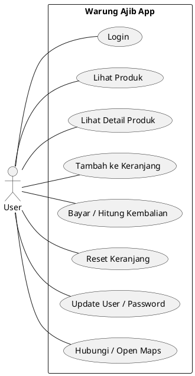
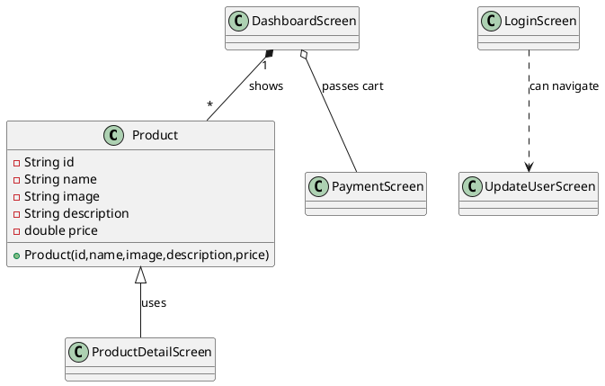
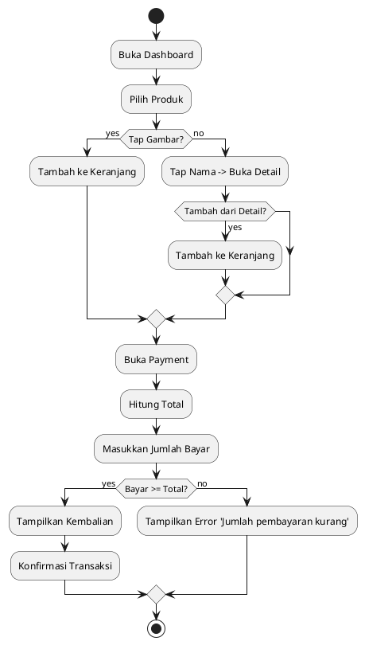

# Laporan UTS — Aplikasi Warung Ajib

## Daftar Isi
- Daftar Isi
- Latar Belakang
- Analisa dan Desain Aplikasi (OOP), Pemodelan UML
- Analisa Kebutuhan User
- Analisa Kebutuhan Hardware dan Software
- Diagram Use Case
- Diagram Class
- Diagram Aktivitas
- Desain Input dan Output
- Implementasi Sistem
- Penutup
- Lampiran Code Program

---

## Latar Belakang

Aplikasi ini dibuat untuk memenuhi kebutuhan UMKM "Warung Ajib" sebagai aplikasi kasir sederhana: menampilkan produk, menambah ke keranjang, menghitung total dan kembalian, serta fitur kontak (telepon / WhatsApp) dan manajemen user sederhana.

Tujuan pembuatan:
- Mempercepat pencatatan transaksi penjualan.
- Meminimalkan kesalahan hitung manual.
- Menyediakan cara cepat menghubungi penjual (WhatsApp/Call) dan menampilkan lokasi pada Maps.

---

## Analisa dan Desain Aplikasi (OOP)

Pendekatan: aplikasi dibangun dengan paradigma OOP menggunakan Flutter (Dart). Komponen utama dipecah menjadi model data, dan beberapa screen (kelas widget) untuk UI dan logika.

Kelas utama & tanggung jawab singkat:
- `Product` (model): menyimpan `id`, `name`, `image`, `description`, `price`.
- `LoginScreen`: autentikasi sederhana, menyimpan akun di `SharedPreferences`.
- `DashboardScreen`: menampilkan daftar produk, menangani keranjang (`Map<String,int>` untuk `productId -> qty`), dan navigasi ke pembayaran/detail.
- `ProductDetailScreen`: menampilkan detail produk, menyediakan aksi "Add to Cart" yang mengembalikan produk ke layar pemanggil.
- `PaymentScreen`: menerima `cart` map, menghitung total, menerima input pembayaran, menghitung kembalian, dan menyediakan reset keranjang.
- `UpdateUserScreen`: mengubah nama user/password oraz logout.

Prinsip desain yang dipakai:
- Single Responsibility: setiap screen bertanggung jawab untuk satu fitur UI/flow.
- Separation of Concerns: penyimpanan persisten (SharedPreferences) hanya dipakai pada layar login/update user.
- Defensive programming: pemeriksaan `mounted` dan penangkapan navigator/messenger sebelum operasi async untuk menghindari masalah context-after-async.

---

## Analisa Kebutuhan User

- Pengguna: pemilik warung / kasir.
- Fungsional:
  - Login / logout (persisten sederhana).
  - Tampilkan produk (grid), tambah ke keranjang (tap gambar), lihat detail (tap nama).
  - Checkout: list item, input jumlah bayar, hitung kembali, konfirmasi, reset.
  - Update user/password.
  - Hubungi via telepon / WhatsApp; buka lokasi (Maps).
- Non-fungsional:
  - Lokal, ringan, mudah dioperasikan.

---

## Analisa Kebutuhan Hardware dan Software

- Hardware: Smartphone Android (untuk jalankan aplikasi), komputer pengembang (macOS). Minimal Android 7+ (disesuaikan Flutter runtime).
- Software: Flutter SDK (tested dengan Flutter 3.x), Dart >=3.x, Android SDK + platform-tools (adb), VS Code/Android Studio.
- Dependensi utama:
  - `shared_preferences` — persistensi akun & sesi.
  - `url_launcher` — membuka whatsapp://, tel:, dan url maps.
  - `flutter_lints` (dev) — membantu perbaikan static analysis.

---

## Diagram Use Case

Gunakan PlantUML untuk merender diagram ini. Salin blok berikut ke file `.puml` atau di extension PlantUML VSCode.



Catatan: untuk merender PlantUML Anda dapat menggunakan VS Code PlantUML extension atau PlantUML server/CLI.

---

## Diagram Class (PlantUML)

Berikut teks PlantUML untuk class diagram sederhana.



---

## Diagram Aktivitas (Activity Diagram)

Flow Pembelian (Use case: Bayar)



---

## Desain Input dan Output

- Input:
  - `username`, `password` (Login)
  - `Jumlah Pembayaran` (numeric) di `PaymentScreen`
  - Update `nama pengguna` dan `password` di `UpdateUserScreen`
- Output/UI:
  - Grid produk (image, name, price)
  - Detail produk (name, price, description, image)
  - Keranjang: list item (name, qty, price, subtotal)
  - Dialog konfirmasi pembayaran (Total/Dibayar/Kembali)
  - SnackBar untuk notifikasi (produk ditambahkan, reset, error)

---

## Implementasi Sistem

Struktur file utama (repo):

```
pubspec.yaml
lib/
  main.dart
  models/product.dart
  screens/
    splash_screen.dart
    login_screen.dart
    dashboard_screen.dart
    product_detail_screen.dart
    payment_screen.dart
    update_user_screen.dart
android/
  app/src/main/AndroidManifest.xml (ditambah <queries> untuk whatsapp/tel)
```

Alur penting:
- Login: `SharedPreferences` menyimpan map `accounts` dan key `currentUser`/`isLoggedIn`.
- Keranjang: `DashboardScreen` menyimpan `Map<String,int>` untuk `productId -> qty`, diteruskan ke `PaymentScreen` via konstruktor.
- WhatsApp/Call: `url_launcher` digunakan; coba `whatsapp://send?phone=` dulu, fallback ke `https://wa.me/`.

Contoh potongan kode (model `Product`):

```dart
class Product {
  final String id;
  final String name;
  final String image;
  final String description;
  final double price;
  Product({required this.id, required this.name, required this.image, required this.description, required this.price});
}

final demoProducts = [
  Product(id: '1', name: 'Sate', image: 'assets/images/Sate.jpg', description: 'Sate enak', price: 25000),
  // ... lainnya
];
```

Contoh penggunaan SharedPreferences (ringkas):

```dart
final prefs = await SharedPreferences.getInstance();
final accountsJson = prefs.getString('accounts');
// parse json => Map<String,dynamic>
prefs.setString('currentUser', username);
prefs.setBool('isLoggedIn', true);
```

---

## Penutup

Aplikasi Warung Ajib menunjukkan implementasi sederhana sistem kasir berbasis Flutter dengan persistensi lokal dan integrasi dengan aplikasi eksternal (WhatsApp, telepon, maps). Rekomendasi fitur lanjutan: penyimpanan riwayat transaksi (sqflite), manajemen stok & CRUD produk, keamanan akun (password hashing), dan sinkronisasi cloud.

---

## Lampiran Code Program (ringkasan)

File penting dan path (lampiran singkat):
- `lib/models/product.dart` — model produk dan data demo.
- `lib/screens/login_screen.dart` — autentikasi & SharedPreferences.
- `lib/screens/dashboard_screen.dart` — grid produk, keranjang, kontak.
- `lib/screens/product_detail_screen.dart` — detail produk, return product on pop.
- `lib/screens/payment_screen.dart` — daftar pesanan, bayar, reset.
- `lib/screens/update_user_screen.dart` — update user/pass, logout.

Jika Anda ingin, saya bisa menambahkan lampiran lengkap (semua file `.dart`) ke README (akan sangat panjang) atau membuat folder `docs/` yang berisi file PlantUML `.puml` terpisah dan gambar yang sudah dirender.

---

## Cara merender PlantUML (singkat)

- Menggunakan VS Code: pasang extension "PlantUML" + Graphviz; buka blok `.puml` atau paste ke file baru lalu klik preview.
- Menggunakan Docker (contoh):

```bash
docker run --rm -v "$PWD":/workspace plantuml/plantuml:latest diagram.puml
```

- Menggunakan PlantUML jar (lokal):

```bash
java -jar plantuml.jar diagram.puml
```

Atau gunakan layanan online PlantUML (paste teks PlantUML ke server/renderer).

---

Jika Anda setuju, saya akan menandai todo internal: `Buat UML dan diagram aktivitas` dan `Lampiran kode` sebagai selesai setelah menambahkan file `.puml` terpisah atau melampirkan kode lengkap. Mau saya lanjutkan dengan menambahkan file `.puml` dan/atau menempelkan seluruh kode ke README? 
# app_E-Commerce_flutter
finish 
